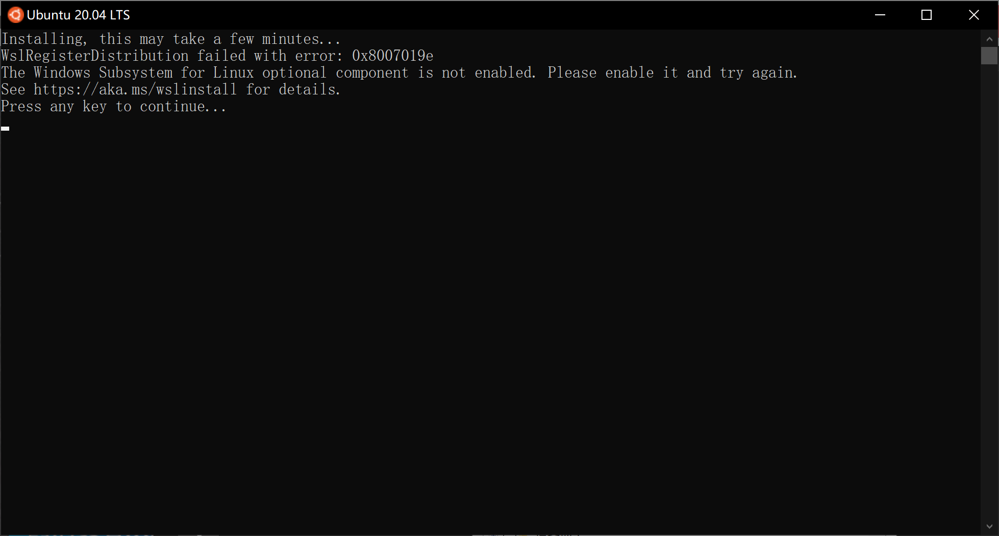
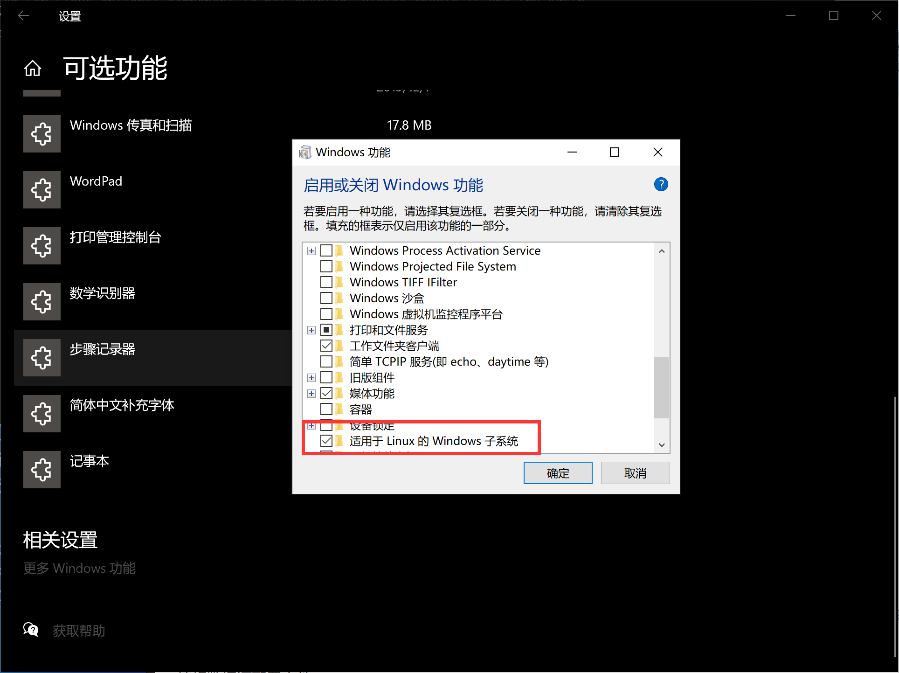
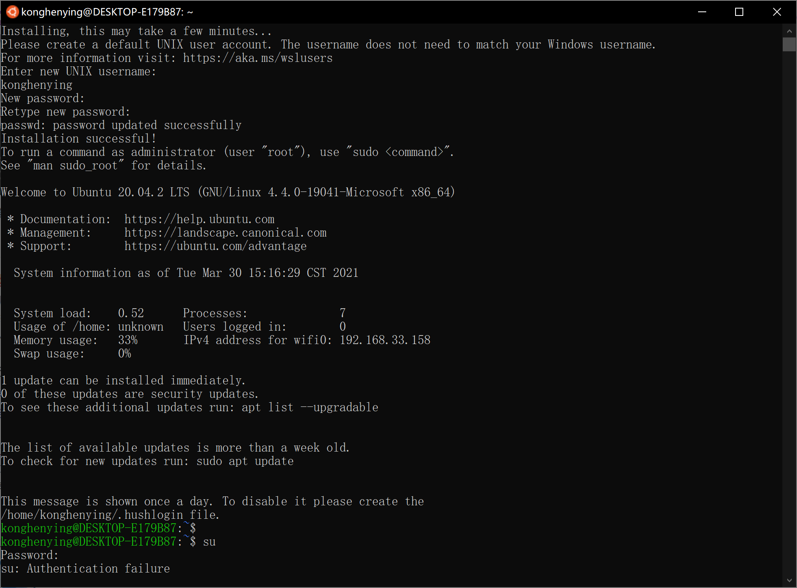

# WIN10子系统使用

   在工作中,难免想本地搭建个测试环境,但由于自己是windows系统,又要找一堆安装包来替换,有些还不是官方的包比如redis windows版.

这时,win10子系统就突出了他的优势.它允许在windows系统中使用Ubuntu 终端来执行Ubuntu命令.且与win10共用一套端口.

## 下载Ubuntu系统

在Microsoft store中找到Ubuntu.并选择需要的版本,点击安装.等待安装完成后,能在开始的所有应用中找到.

## 开启 linux子系统功能

点击后出现如下图所示问题,这是因为我们没有在功能中开启win10 子系统.



位置: 设置->应用->应用与功能->可选功能->相关设置/更多windows功能.

勾选 适用于linux的windows子系统 并确定.



## 设置账户

在首次进入时,需要设置一个用户名与密码来表示默认登入账户,此账户在win10本地进入不需要密码.

但,我们安装一些应用时难免想用root密码.但当键入su时,需要输入密码. 第一次登入哪里知道什么密码,设置都没设置过.



所以需要键入`sudo passwd` 来更改root密码, 首先输入当前用户的密码,再输入两遍要设置的root密码.更改就完成了.在通过su键入设置的密码就可以进入root账户.


## ssh服务建立

1. 如果没有ssh服务,安装:
   `sudo apt install openssh-server`

2. 更改配置

   ```bash
   vi /etc/ssh/sshd_config
   
   #端口
   prot 22
   HostKey /etc/ssh/ssh_host_rsa_key
   # 关闭root登入
   PermitRootLogin no
   PasswordAuthentication yes
   ```

3. 启动服务

   service ssh restart
   就可以连接非root用户

4. 开启自启

   为了安全,子系统的ssh只是在使用的时候才开启.当然如果要实现开机自启,这里来提供一个解决方案.

   4.1. 在win10系统中创建计划,使之开机启动

   

   4.2. 键入启动命令并保存

   `C:\Windows\System32\bash.exe -c "sudo /etc/init.d/ssh start"`

   4.3. 错误解决 no hostkeys available

   ​        重新生成key

   ```bash
    root@空痕影的matebook:/etc/ssh# service ssh start
    * Starting OpenBSD Secure Shell server sshd                                                                            sshd: no hostkeys available -- exiting.
   [fail]
                                                                                                                    	
   root@空痕影的matebook:/etc/ssh# dpkg-reconfigure openssh-server
   Creating SSH2 RSA key; this may take some time ...
   3072 SHA256:ved2QjrhcRDVdkpzurWUsB/OWuCsTeAGCcPr+I4UBU8 root@空痕影的matebook (RSA)
   Creating SSH2 ECDSA key; this may take some time ...
   256 SHA256:l1KPGReYMwfeM25m30OQ2t82ta/aQSa7JxdrNWg51Q4 root@空痕影的matebook (ECDSA)
   Creating SSH2 ED25519 key; this may take some time ...
   256 SHA256:pz9Ly8iAY4nsJFb9Qfa4y2Zb8+eK0okUjgNV3aK28UQ root@空痕影的matebook (ED25519)
   invoke-rc.d: could not determine current runlevel
   root@空痕影的matebook:/etc/ssh# service ssh start
    * Starting OpenBSD Secure Shell server sshd                                                                     [ OK ]                                                                                                                  
   ```

   ## redis

   
   
   ```
   root@空痕影的matebook:~/redis-5.0.12# make
   
   Command 'make' not found, but can be installed with:
   
   apt install make        # version 4.2.1-1.2, or
   apt install make-guile  # version 4.2.1-1.2
   
   root@空痕影的matebook:~/redis-5.0.12# apt install make
   Reading package lists... Done
   Building dependency tree
   Reading state information... Done
   Suggested packages:
     make-doc
   The following NEW packages will be installed:
     make
   0 upgraded, 1 newly installed, 0 to remove and 0 not upgraded.
   Need to get 162 kB of archives.
   After this operation, 393 kB of additional disk space will be used.
   Get:1 http://archive.ubuntu.com/ubuntu focal/main amd64 make amd64 4.2.1-1.2 [162 kB]
   Fetched 162 kB in 1s (115 kB/s)
   Selecting previously unselected package make.
   (Reading database ... 32745 files and directories currently installed.)
   Preparing to unpack .../make_4.2.1-1.2_amd64.deb ...
   Unpacking make (4.2.1-1.2) ...
   Setting up make (4.2.1-1.2) ...
   Processing triggers for man-db (2.9.1-1) ...
   root@空痕影的matebook:~/redis-5.0.12# ls
   00-RELEASENOTES  COPYING    Makefile   redis.conf       runtest-moduleapi  src
   BUGS             INSTALL    README.md  runtest          runtest-sentinel   tests
   CONTRIBUTING     MANIFESTO  deps       runtest-cluster  sentinel.conf      utils
   root@空痕影的matebook:~/redis-5.0.12# make PREFIX=/usr/local/redis install
   cd src && make install
   make[1]: Entering directory '/root/redis-5.0.12/src'
       CC Makefile.dep
   rm -rf redis-server redis-sentinel redis-cli redis-benchmark redis-check-rdb redis-check-aof *.o *.gcda *.gcno *.gcov redis.info lcov-html Makefile.dep dict-benchmark
   (cd ../deps && make distclean)
   make[2]: Entering directory '/root/redis-5.0.12/deps'
   (cd hiredis && make clean) > /dev/null || true
   (cd linenoise && make clean) > /dev/null || true
   (cd lua && make clean) > /dev/null || true
   (cd jemalloc && [ -f Makefile ] && make distclean) > /dev/null || true
   (rm -f .make-*)
   make[2]: Leaving directory '/root/redis-5.0.12/deps'
   (rm -f .make-*)
   echo STD=-std=c99 -pedantic -DREDIS_STATIC='' >> .make-settings
   echo WARN=-Wall -W -Wno-missing-field-initializers >> .make-settings
   echo OPT=-O2 >> .make-settings
   echo MALLOC=jemalloc >> .make-settings
   echo CFLAGS= >> .make-settings
   echo LDFLAGS= >> .make-settings
   echo REDIS_CFLAGS= >> .make-settings
   echo REDIS_LDFLAGS= >> .make-settings
   echo PREV_FINAL_CFLAGS=-std=c99 -pedantic -DREDIS_STATIC='' -Wall -W -Wno-missing-field-initializers -O2 -g -ggdb   -I../deps/hiredis -I../deps/linenoise -I../deps/lua/src -DUSE_JEMALLOC -I../deps/jemalloc/include >> .make-settings
   echo PREV_FINAL_LDFLAGS=  -g -ggdb -rdynamic >> .make-settings
   (cd ../deps && make hiredis linenoise lua jemalloc)
   make[2]: Entering directory '/root/redis-5.0.12/deps'
   (cd hiredis && make clean) > /dev/null || true
   (cd linenoise && make clean) > /dev/null || true
   (cd lua && make clean) > /dev/null || true
   (cd jemalloc && [ -f Makefile ] && make distclean) > /dev/null || true
   (rm -f .make-*)
   (echo "" > .make-cflags)
   (echo "" > .make-ldflags)
   MAKE hiredis
   cd hiredis && make static
   make[3]: Entering directory '/root/redis-5.0.12/deps/hiredis'
   gcc -std=c99 -pedantic -c -O3 -fPIC  -Wall -W -Wstrict-prototypes -Wwrite-strings -g -ggdb  net.c
   make[3]: gcc: Command not found
   make[3]: *** [Makefile:156: net.o] Error 127
   make[3]: Leaving directory '/root/redis-5.0.12/deps/hiredis'
   make[2]: *** [Makefile:46: hiredis] Error 2
   make[2]: Leaving directory '/root/redis-5.0.12/deps'
   make[1]: [Makefile:209: persist-settings] Error 2 (ignored)
       CC adlist.o
   /bin/sh: 1: cc: not found
   make[1]: *** [Makefile:257: adlist.o] Error 127
   make[1]: Leaving directory '/root/redis-5.0.12/src'
   make: *** [Makefile:9: install] Error 2
   ```
   
   

更新apt包:

apt-get update

安装gcc:

apt-get install build-essential

重新编译:

make 

缺少 jemalloc ,可以用libc替代 带上参数

`make MALLOC=libc`

```bash
 make
cd src && make all
make[1]: Entering directory '/root/redis-5.0.12/src'
    CC adlist.o
In file included from adlist.c:34:
zmalloc.h:50:10: fatal error: jemalloc/jemalloc.h: No such file or directory
   50 | #include <jemalloc/jemalloc.h>
      |          ^~~~~~~~~~~~~~~~~~~~~
compilation terminated.
make[1]: *** [Makefile:257: adlist.o] Error 1
make[1]: Leaving directory '/root/redis-5.0.12/src'
make: *** [Makefile:6: all] Error 2
root@空痕影的matebook:~/redis-5.0.12# make MALLOC=libc
```

安装到指定位置

`make PREFIX=/usr/local/redis install`


## win10与linux文件互通

linux文件在win10系统中的位置:C:\Users\xxx\AppData\Local\Packages\CanonicalGroupLimited.Ubuntu20.04onWindows_79rhkp1fndgsc\LocalState\rootfs


win10文件在Ubuntu系统中的位置: /mnt/

